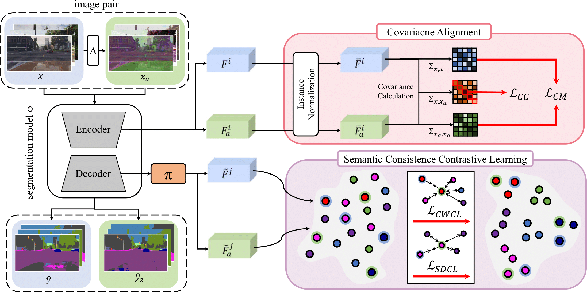
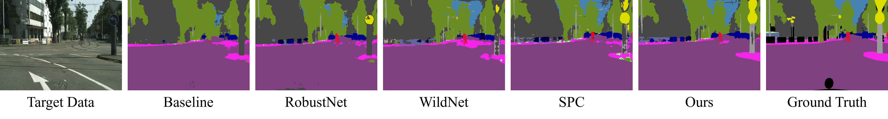

# BlindNet (CVPR 2024) : Official Project Webpage
This repository provides the official PyTorch implementation of the following paper:
> [**Style Blind Domain Generalized Semantic Segmentation via Covariance Alignment and Semantic Consistence Contrastive Learning**](https://arxiv.org/abs/2403.06122)<br>
> Woo-Jin Ahn, Geun-Yeong Yang, Hyun-Duck Choi, Myo-Taeg Lim<br>
> Korea University, Chonnam National University

> **Abstract:**
> *Deep learning models for semantic segmentation often
experience performance degradation when deployed to unseen target domains unidentified during the training phase.
This is mainly due to variations in image texture (i.e. style)
from different data sources. To tackle this challenge, existing domain generalized semantic segmentation (DGSS)
methods attempt to remove style variations from the feature. However, these approaches struggle with the entanglement of style and content, which may lead to the unintentional removal of crucial content information, causing
performance degradation. This study addresses this limitation by proposing BlindNet, a novel DGSS approach that
blinds the style without external modules or datasets. The
main idea behind our proposed approach is to alleviate the
effect of style in the encoder whilst facilitating robust segmentation in the decoder. To achieve this, BlindNet comprises two key components: covariance alignment and semantic consistency contrastive learning. Specifically, the
covariance alignment trains the encoder to uniformly recognize various styles and preserve the content information
of the feature, rather than removing the style-sensitive factor. Meanwhile, semantic consistency contrastive learning
enables the decoder to construct discriminative class embedding space and disentangles features that are vulnerable to misclassification. Through extensive experiments,
our approach outperforms existing DGSS methods, exhibiting robustness and superior performance for semantic segmentation on unseen target domains.* <br>

<p align="center">
  
  
</p>

## Pytorch Implementation

Our pytorch implementation is heaviliy derived from [RobustNet](https://github.com/shachoi/RobustNet) (CVPR 2021). If you use this code in your research, please also cite their work.
[[link to license](https://github.com/shachoi/RobustNet/blob/main/LICENSE)]

### Installation
Clone this repository.
```
git clone https://github.com/root0yang/BlindNet.git
cd BlindNet
```
Install following packages.
```
conda create --name blindnet python=3.6
conda activate blindnet
conda install pytorch==1.2.0 cudatoolkit==10.2
conda install scipy==1.1.0
conda install tqdm==4.46.0
conda install scikit-image==0.16.2
pip install tensorboardX==2.4
pip install thop
imageio_download_bin freeimage
```

### How to Run WildNet
We evaluated the model on [Cityscapes](https://www.cityscapes-dataset.com/), [BDD-100K](https://bair.berkeley.edu/blog/2018/05/30/bdd/), [Synthia](https://synthia-dataset.net/downloads/) ([SYNTHIA-RAND-CITYSCAPES](http://synthia-dataset.net/download/808/)), [GTAV](https://download.visinf.tu-darmstadt.de/data/from_games/) and [Mapillary Vistas](https://www.mapillary.com/dataset/vistas?pKey=2ix3yvnjy9fwqdzwum3t9g&lat=20&lng=0&z=1.5).

We adopt Class uniform sampling proposed in [this paper](https://openaccess.thecvf.com/content_CVPR_2019/papers/Zhu_Improving_Semantic_Segmentation_via_Video_Propagation_and_Label_Relaxation_CVPR_2019_paper.pdf) to handle class imbalance problems.


1. For Cityscapes dataset, download "leftImg8bit_trainvaltest.zip" and "gtFine_trainvaltest.zip" from https://www.cityscapes-dataset.com/downloads/<br>
Unzip the files and make the directory structures as follows.
```
cityscapes
 └ leftImg8bit_trainvaltest
   └ leftImg8bit
     └ train
     └ val
     └ test
 └ gtFine_trainvaltest
   └ gtFine
     └ train
     └ val
     └ test
```
```
bdd-100k
 └ images
   └ train
   └ val
   └ test
 └ labels
   └ train
   └ val
```
```
mapillary
 └ training
   └ images
   └ labels
 └ validation
   └ images
   └ labels
 └ test
   └ images
   └ labels
```

2. We used [GTAV_Split](https://download.visinf.tu-darmstadt.de/data/from_games/code/read_mapping.zip) to split GTAV dataset into training/validation/test set. Please refer the txt files in [split_data](https://github.com/suhyeonlee/WildNet/tree/main/split_data).

```
GTAV
 └ images
   └ train
     └ folder
   └ valid
     └ folder
   └ test
     └ folder
 └ labels
   └ train
     └ folder
   └ valid
     └ folder
   └ test
     └ folder
```

3. We split [Synthia dataset](http://synthia-dataset.net/download/808/) into train/val set following the [RobustNet](https://github.com/shachoi/RobustNet). Please refer the txt files in [split_data](https://github.com/suhyeonlee/WildNet/tree/main/split_data).

```
synthia
 └ RGB
   └ train
   └ val
 └ GT
   └ COLOR
     └ train
     └ val
   └ LABELS
     └ train
     └ val
```

4. You should modify the path in **"<path_to_blindnet>/config.py"** according to your dataset path.
```
#Cityscapes Dir Location
__C.DATASET.CITYSCAPES_DIR = <YOUR_CITYSCAPES_PATH>
#Mapillary Dataset Dir Location
__C.DATASET.MAPILLARY_DIR = <YOUR_MAPILLARY_PATH>
#GTAV Dataset Dir Location
__C.DATASET.GTAV_DIR = <YOUR_GTAV_PATH>
#BDD-100K Dataset Dir Location
__C.DATASET.BDD_DIR = <YOUR_BDD_PATH>
#Synthia Dataset Dir Location
__C.DATASET.SYNTHIA_DIR = <YOUR_SYNTHIA_PATH>
```
5. You can train BlindNet with the following command.
```
<path_to_blindnet>$ CUDA_VISIBLE_DEVICES=0,1 ./scripts/blindnet_train_r50os16_gtav.sh
```

6. You can download Our ResNet-50 model trained with GTAV at Google Drive(will be uploaded soon.) and validate pretrained model with the following command
```
<path_to_blindnet>$ CUDA_VISIBLE_DEVICES=0,1 ./scripts/blindnet_valid_r50os16_gtav.sh <weight_file_location>
```

7. You can infer the segmentation results from images through pretrained model with following commands.
```
<path_to_blindnet>$ CUDA_VISIBLE_DEVICES=0,1 ./scripts/infer_r50os16_cty.sh <weight_file_location> <result_save_location>
```

 
## Terms of Use
This software is for non-commercial use only.
The source code is released under the Attribution-NonCommercial-ShareAlike (CC BY-NC-SA) Licence
(see [this](https://creativecommons.org/licenses/by-nc-sa/4.0/legalcode) for details)
